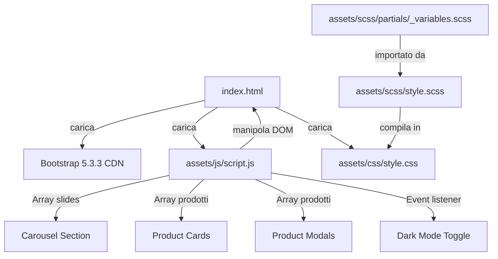
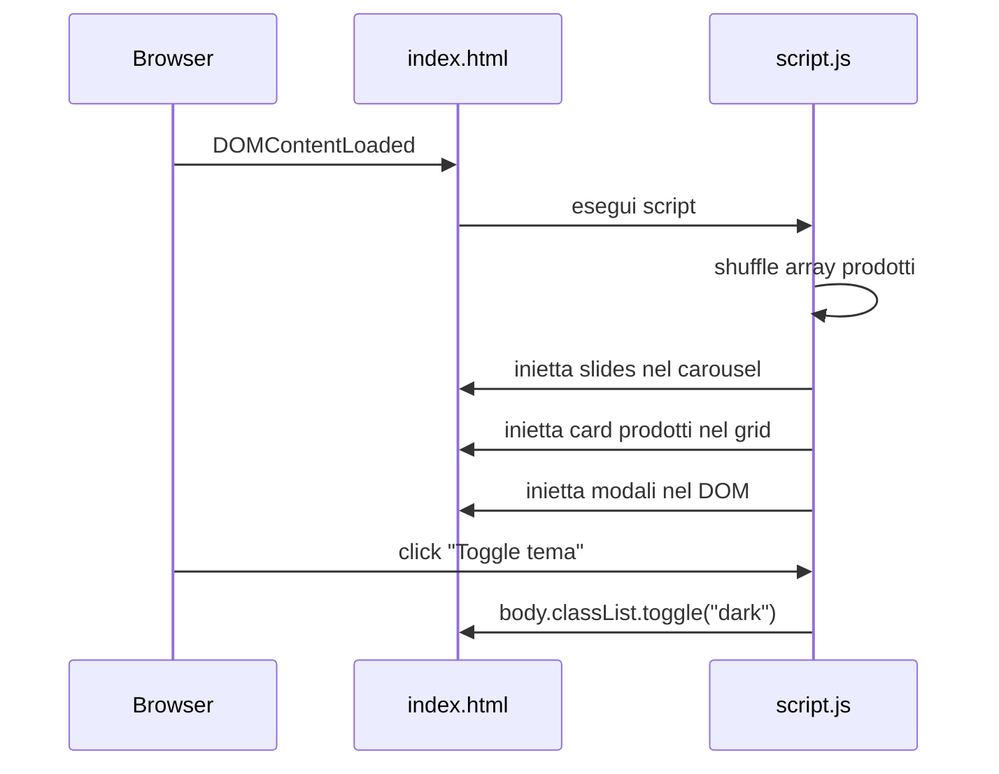
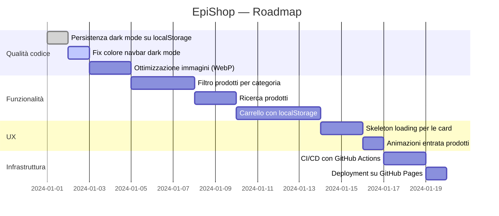

# EpiShop — E-Commerce Statico

Un'applicazione e-commerce frontend sviluppata come esercizio pratico durante il corso **Epicode Full Stack FS0226IT**. Il progetto dimostra l'integrazione di HTML5 semantico, SCSS con mixin parametrici, JavaScript vanilla e Bootstrap 5 per costruire un'interfaccia negozio online con rendering dinamico e supporto al dark mode.

---

## Panoramica

| | |
|---|---|
| **Tipo** | Esercizio didattico — frontend statico |
| **Corso** | Epicode Full Stack FS0226IT — DD1W6 |
| **Stack** | HTML5 · SCSS · Vanilla JS · Bootstrap 5.3.3 |
| **Build tool** | Compilatore SCSS (nessun bundler) |
| **Deployment** | Statico (nessun server backend) |

---

## Funzionalità Principali

- **Carousel hero** renderizzato dinamicamente da array JavaScript
- **Griglia prodotti** con shuffle casuale ad ogni caricamento
- **Modali dettaglio prodotto** generati programmaticamente
- **Toggle dark/light mode** con transizioni CSS smooth (200 ms)
- **Design responsive** da 1 a 4 colonne secondo i breakpoint Bootstrap
- **Sidebar categorie** visibile solo da desktop (`lg` in su)

---

## Architettura



### Flusso di rendering



---

## Tecnologie e Dipendenze

| Tecnologia | Versione | Ruolo |
|---|---|---|
| HTML5 | — | Struttura semantica |
| SCSS | — | Stile preprocessato |
| CSS3 | — | Stile compilato |
| JavaScript | ES6+ | Logica e rendering DOM |
| Bootstrap | 5.3.3 | UI framework (CDN) |

> **Nessuna dipendenza npm** — Bootstrap è incluso via CDN. Non esiste `package.json` né `node_modules`.

---

## Struttura del Progetto

```
FS0226IT---DD1W6/
│
├── index.html                          # Entry point dell'applicazione
│
├── assets/
│   ├── css/
│   │   ├── style.css                   # CSS compilato da SCSS (non modificare)
│   │   └── style.css.map               # Source map per debugging browser
│   │
│   ├── scss/
│   │   ├── style.scss                  # SCSS principale — mixin, temi, card
│   │   └── partials/
│   │       └── _variables.scss         # Variabili globali SCSS
│   │
│   ├── js/
│   │   └── script.js                   # Tutta la logica JavaScript
│   │
│   └── img/
│       ├── pexels-bertoli-26903900.jpg          # Borsa city (~787 KB)
│       ├── pexels-irrabagon-35254141.jpg         # Vinili (~3.6 MB)
│       ├── pexels-marsianin-18199559.jpg         # T-shirt (~1.4 MB)
│       ├── pexels-n-voitkevich-6214457.jpg       # Immagine aggiuntiva (~4.3 MB)
│       └── pexels-rubenstein111rebello-6246831.jpg  # Sneaker (~1.4 MB)
│
└── .vscode/
    └── settings.json                   # Porta Live Server: 5502
```

---

## Installazione

### Prerequisiti

- Un browser moderno (Chrome, Firefox, Edge, Safari)
- Un editor di testo (consigliato: **VS Code**)
- Estensione VS Code **Live Server** (opzionale, per ricarica automatica)
- Un compilatore SCSS se si vuole modificare i file in `assets/scss/`
  - Opzione A: estensione VS Code **Live Sass Compiler**
  - Opzione B: `sass` da riga di comando (`npm install -g sass`)

### Setup locale

```bash
# Clona il repository
git clone <url-del-repository>

# Entra nella cartella
cd FS0226IT---DD1W6
```

Non è necessaria alcuna installazione di dipendenze: il progetto è interamente statico.

---

## Avvio del Progetto

### Con VS Code Live Server

1. Apri la cartella in VS Code
2. Clicca con il tasto destro su `index.html`
3. Seleziona **"Open with Live Server"**
4. Il browser si aprirà su `http://127.0.0.1:5502`

### Senza estensione

Apri direttamente `index.html` nel browser:

```bash
# Windows
start index.html

# macOS
open index.html

# Linux
xdg-open index.html
```

### Compilazione SCSS

Ogni volta che si modifica un file in `assets/scss/`, è necessario ricompilare:

```bash
# Compilazione una tantum
sass assets/scss/style.scss assets/css/style.css

# Watch mode (ricompila ad ogni salvataggio)
sass --watch assets/scss/style.scss:assets/css/style.css
```

> Con l'estensione **Live Sass Compiler** di VS Code la compilazione avviene automaticamente al salvataggio.

---

## Configurazione

| Variabile | Descrizione | Obbligatoria | Default |
|---|---|---|---|
| `liveServer.settings.port` | Porta del Live Server in VS Code | No | `5502` |

Non esistono variabili d'ambiente applicative: il progetto non usa build tool né backend.

### Variabili SCSS

Definite in [assets/scss/partials/_variables.scss](assets/scss/partials/_variables.scss):

```scss
$brand-primary:       #0d6efd;                                          // Colore primario Bootstrap
$brand-primary-dark:  darken($brand-primary, 15%);                      // Variante scura per dark mode
$radius-base:         0.25rem;                                          // Border radius delle card
$shadow-card:         0 0.125rem 0.25rem rgba(0, 0, 0, 0.075);         // Ombra card default
$shadow-card-hover:   0 0.125rem 0.25rem rgba(0, 0, 0, 0.095);         // Ombra card on hover
```

---

## Logica Applicativa

### Dati

Tutti i dati dell'applicazione sono hardcoded in `script.js` come array JavaScript.

**Array `slides`** — slide del carousel:

```javascript
const slides = [
  { title: "Saldi di primavera", subtitle: "Fino al -50%...", bgColor: "bg-primary", active: true },
  { title: "Nuova collezione",   subtitle: "Scopri i nuovi...", bgColor: "bg-success", active: false },
  { title: "Spedizione gratis",  subtitle: "Su tutti gli...",   bgColor: "bg-danger",  active: false },
];
```

**Array `prodotti`** — catalogo prodotti:

```javascript
const prodotti = [
  { id: 1, nome: "Sneaker run",         prezzo: "89,00",  img: "pexels-rubenstein111rebello-6246831.jpg", ... },
  { id: 2, nome: "T-shirt basic",       prezzo: "19,00",  img: "pexels-marsianin-18199559.jpg",           ... },
  { id: 3, nome: "Borsa city",          prezzo: "49,00",  img: "pexels-bertoli-26903900.jpg",             ... },
  { id: 4, nome: "Vinili da collezione",prezzo: "59,00",  img: "pexels-irrabagon-35254141.jpg",           ... },
];
```

### Rendering Dinamico

Il JavaScript non usa framework: manipola direttamente il DOM con `createElement` e `innerHTML`.

**1. Carousel** — inietta le slide nell'elemento `#carouselInner`:

```javascript
slides.forEach((slide) => {
  const div = document.createElement("div");
  div.classList.add("carousel-item", slide.bgColor);
  if (slide.active) div.classList.add("active");
  div.innerHTML = `<div class="container"><h2>${slide.title}</h2>...</div>`;
  carouselInner.appendChild(div);
});
```

**2. Griglia prodotti** — shuffle casuale, poi creazione card Bootstrap:

```javascript
prodotti.sort(() => Math.random() - 0.5); // shuffle non deterministico

prodotti.forEach((p) => {
  const col = document.createElement("div");
  col.classList.add("col-12", "col-sm-6", "col-lg-4", "col-xl-3");
  col.innerHTML = `
    <div class="card h-100">
      
      <div class="card-body">...</div>
      <div class="card-footer">
        <button data-bs-target="#modal${p.id}" data-bs-toggle="modal">Dettagli</button>
      </div>
    </div>`;
  prodottiContainer.appendChild(col);
});
```

**3. Modali** — generati per ogni prodotto con struttura Bootstrap standard.

**4. Dark mode toggle**:

```javascript
document.getElementById("toggle-tema").addEventListener("click", function () {
  document.body.classList.toggle("dark");
  this.textContent = document.body.classList.contains("dark") ? "Tema chiaro" : "Tema scuro";
});
```

### Pattern architetturali

- **Data-driven rendering**: i dati sono separati dalla logica di presentazione
- **Progressive enhancement**: la struttura HTML base è presente, il JS arricchisce l'esperienza
- **CSS class toggle**: il tema dark si attiva aggiungendo/rimuovendo la classe `dark` sul `body`

---

## Frontend

### Pagine

| Pagina | File | Descrizione |
|---|---|---|
| Home | `index.html` | Unica pagina (SPA statica) |

### Sezioni della pagina

```
index.html
├── <nav>         Navbar con logo, menu, toggle tema
├── <section>     Carousel hero (3 slide)
├── <main>
│   ├── <div>     Alert spedizione gratuita (dismissibile)
│   ├── <aside>   Sidebar categorie (solo desktop lg+)
│   └── <section> Griglia prodotti renderizzata da JS
├── <div>         4 modali Bootstrap (dettaglio prodotto)
└── <footer>      Footer 3 colonne (Contatti, Social, Link)
```

### Componenti UI

| Componente | Libreria | Note |
|---|---|---|
| Navbar responsive | Bootstrap 5 | Collapse su mobile |
| Carousel automatico | Bootstrap 5 | Intervallo 3500 ms |
| Card prodotto | Bootstrap 5 + CSS custom | Hover lift + shadow |
| Modal dettaglio | Bootstrap 5 | Apertura via `data-bs-toggle` |
| Alert dismissibile | Bootstrap 5 | — |
| Toggle dark mode | Custom JS + SCSS | Classe `dark` su `body` |

### Theming SCSS

Il file [assets/scss/style.scss](assets/scss/style.scss) usa un mixin parametrico per gestire entrambi i temi:

```scss
@mixin tema($bg, $testo, $card-bg, $bordo, $muted) {
  body          { background-color: $bg;       color: $testo;  }
  .card         { background-color: $card-bg;  border-color: $bordo; }
  .card-text    { color: $muted; }
  .modal-content{ background-color: $card-bg;  color: $testo;  }
  aside         { background-color: $card-bg;  border-color: $bordo; }
}

// Tema light (default)
@include tema(#fafafa, #1a1a1a, #ffffff, #e0e0e0, #6c757d);

// Tema dark
body.dark {
  background-color: #121212;
  color: #e0e0e0;
  .card           { background-color: #1e1e1e; border-color: #333333; }
  .modal-content  { background-color: #1e1e1e; }
}
```

### Responsive Breakpoints

| Breakpoint | Colonne griglia prodotti | Sidebar |
|---|---|---|
| `xs` (< 576px) | 1 | nascosta |
| `sm` (≥ 576px) | 2 | nascosta |
| `lg` (≥ 992px) | 3 | visibile |
| `xl` (≥ 1200px) | 4 | visibile |

---

## Deployment

Il progetto è un sito statico puro: non richiede server, database o build pipeline.

### Build

La sola operazione di "build" è la compilazione SCSS:

```bash
sass assets/scss/style.scss assets/css/style.css --style=compressed
```

Il flag `--style=compressed` genera un CSS minificato adatto alla produzione.

### Hosting statico

Il progetto può essere pubblicato su qualsiasi hosting statico:

| Piattaforma | Procedura |
|---|---|
| **GitHub Pages** | Abilita Pages dal branch `main`, cartella root |
| **Netlify** | Drag & drop della cartella sul dashboard |
| **Vercel** | `vercel --prod` dalla root del progetto |
| **Qualsiasi server HTTP** | Copia i file sul webroot (es. `/var/www/html`) |

### CI/CD

Non determinabile dal codice analizzato. Non è presente alcun file di configurazione CI/CD (`.github/workflows/`, `netlify.toml`, `vercel.json`, ecc.).

### Docker

Non determinabile dal codice analizzato. Non è presente un `Dockerfile`.

---

## Troubleshooting

### Le modifiche SCSS non si riflettono nel browser

**Causa**: il CSS viene compilato dal file SCSS, ma non viene ricompilato automaticamente.

**Soluzione**:
1. Ricompila manualmente: `sass assets/scss/style.scss assets/css/style.css`
2. Oppure attiva la watch mode: `sass --watch assets/scss/style.scss:assets/css/style.css`
3. Oppure usa l'estensione **Live Sass Compiler** in VS Code

---

### Il carousel non mostra le slide

**Causa**: il `#carouselInner` non viene trovato nel DOM al momento dell'esecuzione dello script.

**Soluzione**: verificare che `script.js` sia incluso in fondo al `<body>`, dopo il markup HTML.

---

### Le immagini non si caricano

**Causa**: percorsi relativi errati se il file viene aperto da una cartella diversa.

**Soluzione**: aprire `index.html` dalla root del progetto, non spostarla in altre directory.

---

### Il dark mode non persiste al ricaricamento

**Causa**: la preferenza viene gestita solo in memoria con `classList.toggle`. Non esiste persistenza su `localStorage`.

**Soluzione** (miglioramento possibile):

```javascript
// Salvare la preferenza
localStorage.setItem("tema", "dark");

// Ripristinare al caricamento
if (localStorage.getItem("tema") === "dark") {
  document.body.classList.add("dark");
}
```

---

### Il colore della navbar in dark mode appare sbagliato

**Causa**: la funzione SCSS `darken()` su `$brand-primary` genera un valore RGB non valido quando compilata in certi contesti.

**Soluzione**: sostituire in `_variables.scss` il valore di `$brand-primary-dark` con un hex diretto:

```scss
$brand-primary-dark: #0a58ca; // invece di darken(#0d6efd, 15%)
```

---

## Roadmap

Basata sulla struttura attuale del progetto e sulle funzionalità mancanti identificate durante l'analisi.



### Miglioramenti prioritari

- [ ] **Persistenza dark mode** — salvare la preferenza in `localStorage`
- [ ] **Ottimizzazione immagini** — le foto da Pexels sono molto pesanti (fino a 4.3 MB); convertire in WebP e ridimensionare
- [ ] **Filtro categorie** — la sidebar categorie è decorativa, implementarne la logica di filtro
- [ ] **Carrello** — aggiungere funzionalità di aggiunta al carrello con contatore in navbar
- [ ] **Accessibilità** — aggiungere attributi `aria-*` ai componenti interattivi

---

## Licenza

[MIT](LICENSE)

---

*Progetto realizzato nell'ambito del corso Epicode Full Stack FS0226IT.*
